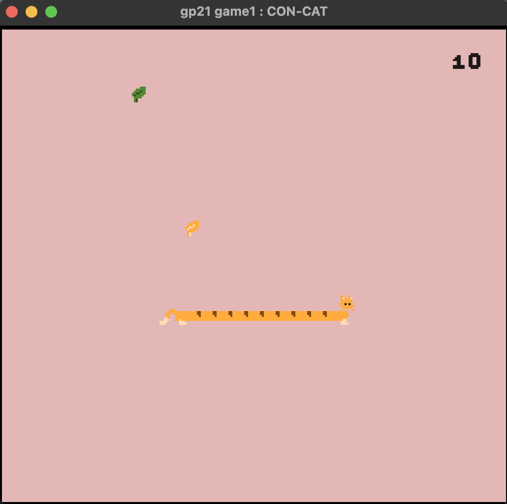
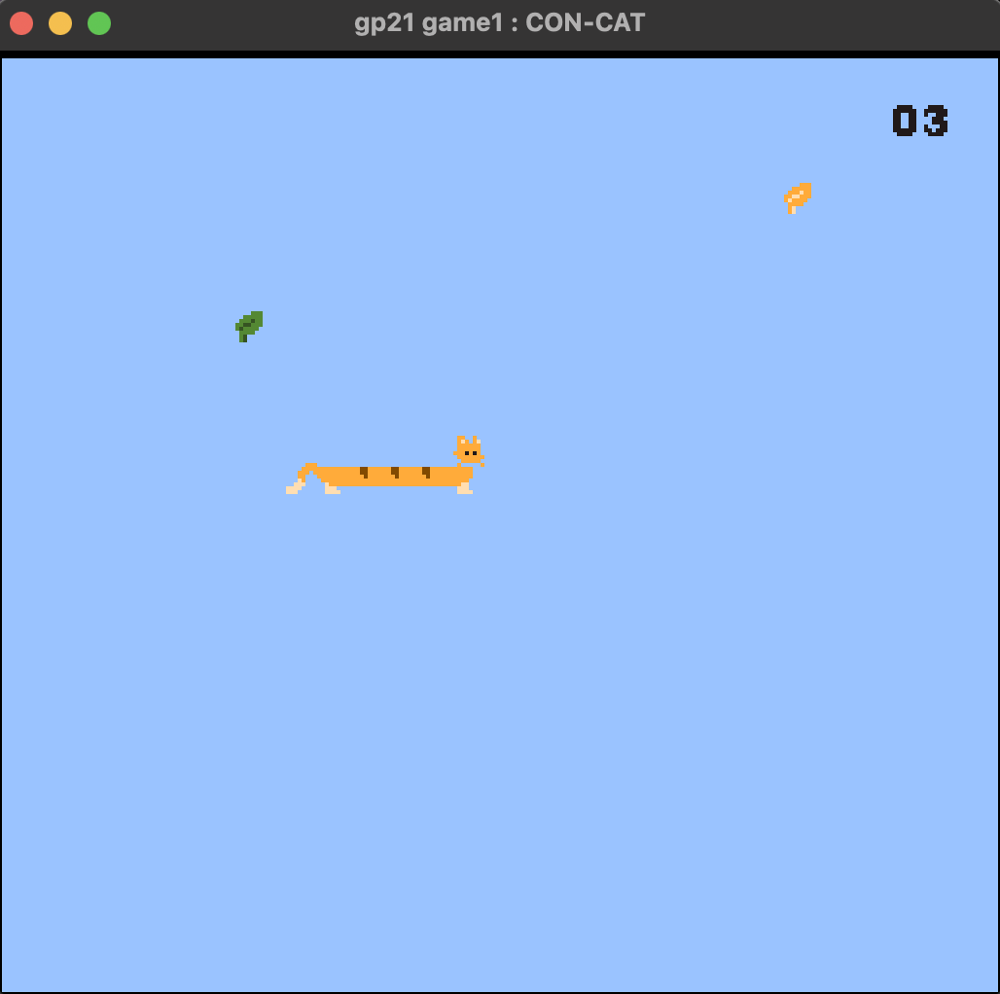

# CON-CAT

Author: Ashley Kim (ayk2)

Date : 9/8/2022

Design: CON-CAT is a game that elongates the cat as it eats the healthy catnip. If it consumes rotten catnip or leave its boundary, then it will crouch. 

Screen Shot:

## How My Asset Pipeline Works: ##

TLDR; 4x4 tile (each tile is 8x8 px) designs imported as one png and parsed in code to separate tiles.

Sprite is imported with `load_png` function in `load_save_png.hpp` using [catto_num_leaf.png](catto_num_leaf.png) as an input source. I drew 16 tile designs and imported as one png file (5 cat parts, 1 leaf, 10 numbers).

Once I have a vector of png's pixel color info, I separated them into tiles and kept track of the tile index on the tile table for each tile design. Exact tile index mapping info can be found in `PlayMode.cpp`, around line 86. I hardcoded the colors into palettes since there weren't that many color and I knew the 4 colors I used for the cat and 2 colors for the leaf. In the process, I also made another palette for the background.

Now that I have palette and tile designs, I drew the wanted design and color of the tiles by entering the index of it on the table to `ppu.sprites[sprite#].index`. Location of this sprite to be drawn is defined by x and y positions and attributes managed the color palette.

## How To Play: ##

**PRESS** up/down/left/right to go in corresponding direction. 
(No need to constantly press down! It has a set speed that accelerates based on score)

**PRESS** space to pause.

**STORY:**
You are a cheese cat looking for catnip. There are two versions of catnips : healthy green catnip and rotten yellow catnip. 
If the cat eats a green catnip, it feels happy and elongates. (+1 score)
If the cat eats a yellow catnip, the bitter taste wakes it up and makes it curl up. (-1 score) Too much of yellow catnip (<0 score) would cause game over.

If the cat leaves its teritory (i.e. screen), then it will be at a danger and would be placed back on screen with a loss of a catnip. 

The main goal is to consume as many healthy catnip as possible. The number of catnips in action (i.e. score) is shown on the top right corner. Since catnip is like a drug to cats, the speed at which the cat moves will get faster each time it eats a healthy catnip. 

This game was built with [NEST](NEST.md).

